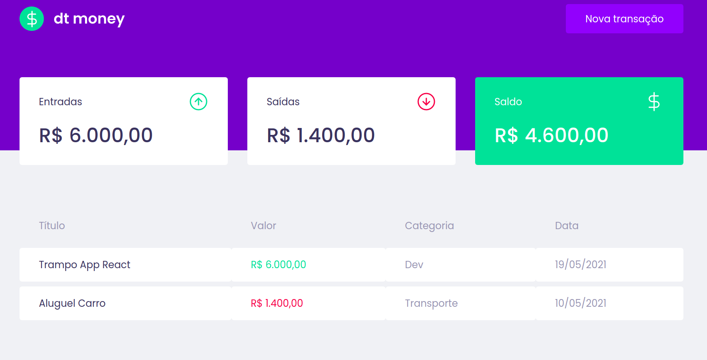

# GitHub Explorer

## What's it?
This is a financial app project to manage your budget. This was built with ReactJS, TypeScript and MirageJS.

## Main concepts:
Immutability, states, hooks, contexts, styled components and componentization.

## Sample view:

## Requirements:
1. `node 12.14.0 or >`

## Running the project (locally):

1. `cd dtmoney`
2. `yarn`
3. `yarn start`
